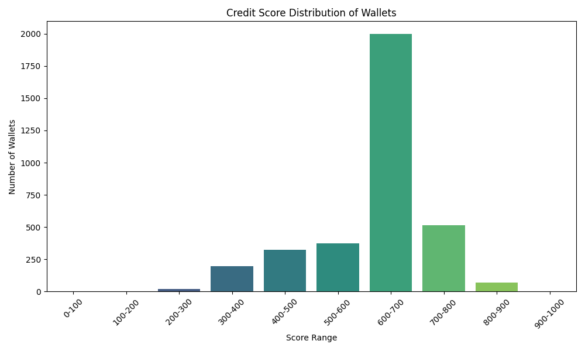

# Wallet Credit Score Analysis

### 🔍 Score Distribution

The histogram above shows the distribution of credit scores across all wallets. Most wallets tend to cluster in the middle-to-high range, indicating reasonably responsible behavior.

### 📉 Behavior of Low-Scoring Wallets (Score < 300)
- Total wallets in this range: 21
- Common traits:
  - High number of liquidations
  - Very low repayment ratios
  - Low transaction activity
  - Minimal asset diversity

### 📈 Behavior of High-Scoring Wallets (Score > 800)
- Total wallets in this range: 69
- Common traits:
  - Near-perfect repayment ratios
  - High number of transactions across long active periods
  - Good asset diversity
  - Low to zero liquidations

This scoring system offers a meaningful snapshot of DeFi wallet reliability based on on-chain behavior.
